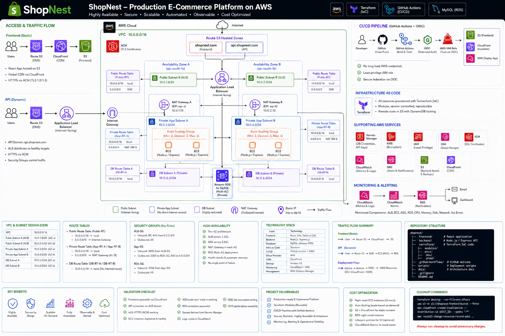

# ShopNest — Production E-Commerce Application

Production-style e-commerce platform deployed on AWS with a highly available two-AZ application tier, private networking, managed MySQL, Terraform IaC, GitHub Actions CI/CD, GitHub OIDC, CloudWatch monitoring, SNS alerting, and SSM-based deployments.

## At a Glance

| Area               | Implementation                                        |
| ------------------ | ----------------------------------------------------- |
| Application        | React + Vite, Node.js + Express, MySQL                |
| AWS                | VPC, ALB, EC2/ASG, RDS, S3, CloudFront, Route 53, ACM |
| Security           | Private subnets, IAM, Secrets Manager, KMS, OIDC      |
| IaC                | Terraform                                             |
| CI/CD              | GitHub Actions                                        |
| Operations         | CloudWatch + SNS                                      |
| Backend deployment | AWS Systems Manager                                   |

## Architecture
## Architecture



The platform is deployed across two Availability Zones with isolated public, private application, and database subnets. The frontend is delivered through CloudFront and S3, while API traffic is routed through an internet-facing Application Load Balancer to the private EC2 Auto Scaling tier. The application tier connects to Multi-AZ Amazon RDS for MySQL.

```

## Key Highlights

* Multi-AZ application tier behind an Application Load Balancer and Auto Scaling Group
* Private EC2 application tier and isolated RDS database tier
* S3 + CloudFront static frontend delivery with HTTPS
* Secrets Manager-backed runtime database credentials
* Terraform-managed AWS infrastructure
* GitHub Actions CI/CD with OIDC-based AWS authentication
* CloudWatch alarms + SNS notifications and SSM-based backend deployment

## Technology Stack

### Application

* React
* Vite
* Node.js
* Express
* MySQL
* Axios

### AWS

* Amazon VPC
* Application Load Balancer
* EC2
* Auto Scaling
* Amazon RDS for MySQL
* Amazon S3
* Amazon CloudFront
* Route 53
* AWS Certificate Manager
* AWS Secrets Manager
* AWS KMS
* AWS Systems Manager
* Amazon CloudWatch
* Amazon SNS
* AWS IAM
* NAT Gateway
* Internet Gateway

### DevOps

* Terraform
* Git
* GitHub
* GitHub Actions
* GitHub OIDC

## Repository Structure

```text
prod-ecommerce-app/
├── .github/
│   └── workflows/
│       ├── ci.yml
│       └── deploy.yml
├── backend/
│   ├── app.js
│   ├── db.js
│   ├── s3.js
│   ├── server.js
│   ├── tests/
│   │   └── app.test.js
│   ├── package.json
│   └── package-lock.json
├── database/
│   ├── schema.sql
│   └── README.md
├── frontend/
│   ├── src/
│   ├── public/
│   ├── package.json
│   └── package-lock.json
├── terraform/
│   ├── alb.tf
│   ├── asg.tf
│   ├── cloudfront.tf
│   ├── cloudwatch.tf
│   ├── iam.tf
│   ├── launch_template.tf
│   ├── rds.tf
│   ├── route53.tf
│   ├── s3.tf
│   ├── security_groups.tf
│   ├── subnets.tf
│   ├── vpc.tf
│   ├── user_data.sh
│   └── .terraform.lock.hcl
├── .gitignore
├── LICENSE
└── README.md
```

## Network Architecture

The AWS environment uses a dedicated VPC with separate public, application, and database subnets across two Availability Zones.

### Subnets

```text
VPC: 10.0.0.0/16

Public
├── Public Subnet A → 10.0.1.0/24
└── Public Subnet B → 10.0.2.0/24

Application
├── App Subnet A → 10.0.3.0/24
└── App Subnet B → 10.0.4.0/24

Database
├── DB Subnet A → 10.0.5.0/24
└── DB Subnet B → 10.0.6.0/24
```

The ALB is internet-facing, while the application and database resources remain in private subnets.

NAT Gateways provide controlled outbound connectivity for private application instances.

## Application Layer

The backend is a Node.js and Express API listening on port `3000`.

### API Endpoints

| Method | Endpoint                  | Purpose                         |
| ------ | ------------------------- | ------------------------------- |
| GET    | `/`                       | Application information         |
| GET    | `/health`                 | Application and database health |
| GET    | `/api/products`           | Retrieve products               |
| GET    | `/api/products/:id`       | Retrieve a specific product     |
| POST   | `/api/products/:id/image` | Upload a product image          |

The `/health` endpoint is used by both the load balancer and post-deployment validation.

## Database

Amazon RDS for MySQL provides the managed database layer.

Database credentials are retrieved from AWS Secrets Manager at runtime by the EC2 bootstrap process.

The application does not commit database passwords or AWS credentials to Git.

## Storage and Assets

Product assets are stored in Amazon S3.

The application uses:

* S3 object storage
* KMS encryption for application-managed assets
* Presigned URLs for private product-image access

The frontend is hosted separately in an S3 bucket and delivered through CloudFront.

## Frontend Delivery

The React application is built using Vite.

Production builds are deployed to:

```text
Amazon S3 → CloudFront → HTTPS → Route 53
```

The production API endpoint is configured during the build:

```text
https://api.gowthamcloud.site
```

## Security

The architecture follows several security controls:

* Application servers are deployed in private subnets
* Database servers are isolated in database subnets
* Security groups restrict inter-tier communication
* RDS credentials are stored in Secrets Manager
* S3 public access is blocked
* CloudFront uses an origin access control configuration
* HTTPS is enabled using ACM certificates
* EC2 uses an IAM instance role
* GitHub Actions uses OIDC rather than long-lived AWS access keys
* GitHub Actions deployment permissions are scoped to the ShopNest resources
* Terraform state and environment files are excluded from Git

## Terraform Infrastructure as Code

The AWS infrastructure is managed using Terraform.

Terraform was also used to bring the previously deployed AWS infrastructure into a managed and reproducible configuration.

Important Terraform practices used:

```text
terraform fmt
terraform validate
terraform plan
terraform apply
```

The final validation produced:

```text
No changes. Your infrastructure matches the configuration.
```

Terraform state files are intentionally excluded from Git.

The provider lock file is committed to ensure consistent provider resolution.

## CI Pipeline

GitHub Actions provides automated continuous integration.

### CI workflow

```text
Pull Request
     |
     +--> Backend Tests
     |
     +--> Frontend Lint
     |
     +--> Frontend Production Build
     |
     +--> Terraform Format Check
     |
     +--> Terraform Validation
```

### Backend tests

The backend uses Node's built-in test runner with Supertest.

The test suite validates:

* API root response
* Database health response
* Product listing
* Product lookup
* Missing product handling
* Unknown route handling

Final local test result:

```text
6 tests
6 passed
0 failed
```

### Frontend validation

```bash
npm ci
npm run lint
npm run build
```

The production Vite build completes successfully.

## Continuous Deployment

GitHub Actions also provides automated deployment after changes are pushed to `main`.

### Deployment flow

```text
Push to main
     |
     v
Validation gates
     |
     +--> Backend tests
     +--> Frontend lint/build
     +--> Terraform validation
     |
     v
GitHub OIDC
     |
     v
AWS IAM deployment role
     |
     +--> S3 frontend deployment
     |
     +--> CloudFront invalidation
     |
     +--> SSM backend deployment
     |
     v
Health checks
```

## GitHub OIDC

GitHub Actions authenticates to AWS using OpenID Connect.

No long-lived AWS access key is stored in GitHub Actions.

The deployment role is restricted to the ShopNest repository and `main` branch using GitHub's immutable repository identity claims.

The deployment role has only the permissions required for:

* S3 frontend deployment
* CloudFront invalidation
* SSM backend deployment
* Deployment target discovery

## Backend Deployment

The backend is deployed to the private EC2 instances through AWS Systems Manager Run Command.

The deployment process:

```text
Fetch main branch
      |
Reset to deployed commit
      |
Install production dependencies
      |
Restart PM2 application
      |
Local /health check
```

The deployment targets are selected by the EC2 tag:

```text
Name = prod-ecommerce-app-server
```

This allows the Auto Scaling Group to replace instances without requiring hard-coded instance IDs in the deployment workflow.

## Monitoring and Alerting

CloudWatch monitors the critical application and infrastructure signals.

### Custom alarms

| Alarm                                   | Metric                  | State |
| --------------------------------------- | ----------------------- | ----- |
| `prod-ecommerce-alb-5xx`                | HTTPCode_ELB_5XX_Count  | OK    |
| `prod-ecommerce-alb-no-healthy-targets` | HealthyHostCount        | OK    |
| `prod-ecommerce-asg-low-capacity`       | GroupInServiceInstances | OK    |
| `prod-ecommerce-rds-high-cpu`           | CPUUtilization          | OK    |
| `prod-ecommerce-rds-low-storage`        | FreeStorageSpace        | OK    |

All five custom alarms are connected to the SNS notification topic.

SNS email subscription:

```text
gowthamchandrasekar01@gmail.com
```

## High Availability Validation

The final ALB target-health verification showed two healthy application instances:

```text
i-0be7d8ebb3a4f0265 → healthy
i-0f8e1488fe591897d → healthy
```

Both instances serve the application on port `3000`.

The Auto Scaling Group maintains two application instances across separate Availability Zones.

## Production Verification

### Frontend

```text
https://shopnest.gowthamcloud.site/
```

Verified response:

```text
HTTP/2 200
```

The response was successfully served through CloudFront from the S3 origin.

### Backend

```text
https://api.gowthamcloud.site/health
```

Verified response:

```json
{
  "status": "healthy",
  "database": "connected"
}
```

### ALB

Final target health:

```text
2/2 targets healthy
```

### Infrastructure

Final Terraform verification:

```text
No changes. Your infrastructure matches the configuration.
```

## CI/CD Result

The final GitHub Actions implementation successfully demonstrated:

```text
GitHub push
    ↓
Automated CI
    ↓
Automated CD
    ↓
S3 deployment
    ↓
CloudFront invalidation
    ↓
SSM backend deployment
    ↓
Application health verification
```

This provides a complete GitHub Actions-based CI/CD implementation for the project.

## Local Development

### Backend

Requirements:

* Node.js 20+
* MySQL

```bash
cd backend
npm ci
npm test
npm start
```

### Frontend

```bash
cd frontend
npm ci
npm run lint
npm run build
npm run dev
```

Do not commit `.env`, passwords, access keys, or other secrets.

## Cleanup

The AWS environment is intended to be destroyed after documentation and screenshots have been completed so that unnecessary AWS resources do not continue generating charges.

Before cleanup:

```bash
cd terraform
terraform plan
```

Then destroy only when the project evidence has been captured and the repository documentation is complete.

## GitHub Repository

[github.com/gowthamchandrasekar01-art/prod-ecommerce-app](https://github.com/gowthamchandrasekar01-art/prod-ecommerce-app)

## Project Status

```text
AWS Architecture       ✅
Terraform              ✅
Security               ✅
Application            ✅
Testing                ✅
CI                     ✅
CD                     ✅
Monitoring             ✅
Live Verification      ✅
```
